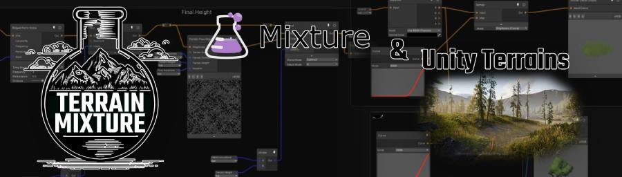

> Extension for [Mixture](alelievr/Mixture) enabling Procedural Terrain Generation.

> Status: 🚧 Proof Of Concept 🚧

## Project Description.

With inclusion of Terrain Topology Nodes, Mixture becomes a powerful tool for Procedural Terrain Generation.

Unlike other Editor-Centered solutions, Mixture batches entire graph as single Compute Buffer and executes on GPU in
background.

Mixture allows using both Fragment and Compute Shaders for Node implementations.

This package aims to provide a Procedural Terrain Generation framework utilizing Mixture as Node-Based Procedural
Engine.

Texture Outputs, such as Terrain Heightmap, Splat Maps, Detail Density Maps are simple to generate using Mixture's
powerful arsenal.

Additionally, Compute Buffer support allows for placing Tree Instances.

## Features.

* [x] Output various Terrain data from Static Mixture Graphs:
    * [x] Terrain Height
    * [x] Splat Maps
    * [x] Detail Output via Details Output Node
    * [x] Tree Instances via Trees Output Node
* [x] Background Terrain sync with configurable amount of Runtime Skipped Frames.
* [ ] Runtime Tile-based "endless" setup.
* [x] In-Editor setup with realtime previews (using Editor Coroutines).
* [ ] Biome Blending.
* [ ] Stamps.
* [ ] Scene Capture feature, rendering Terrain Objects to Texture Masks.

## Usage.

1. Create new Terrain Mixture Asset from Menu:
   > `Assets/Create/🧪Terrain Mixture🏔/⛰️Terrain Mixture Graph`
2. Use custom Terrain Mixture nodes to define Terrain Outputs:
   > **[Terrain Output Nodes Documentation](docs/terrain-output-nodes.md)**
3. For now, there's only In-Editor workflow:
    * Create Terrain GameObject
    * Attach `TerrainMixtureSingleTerrain` MonoBehaviour
    * Assign Graph property to your graph created in step 1.
    * Assign Terrain property to your Terrain.
    * Terrain Mixture will react to runtime changes in Graph and update Terrain accordingly.
